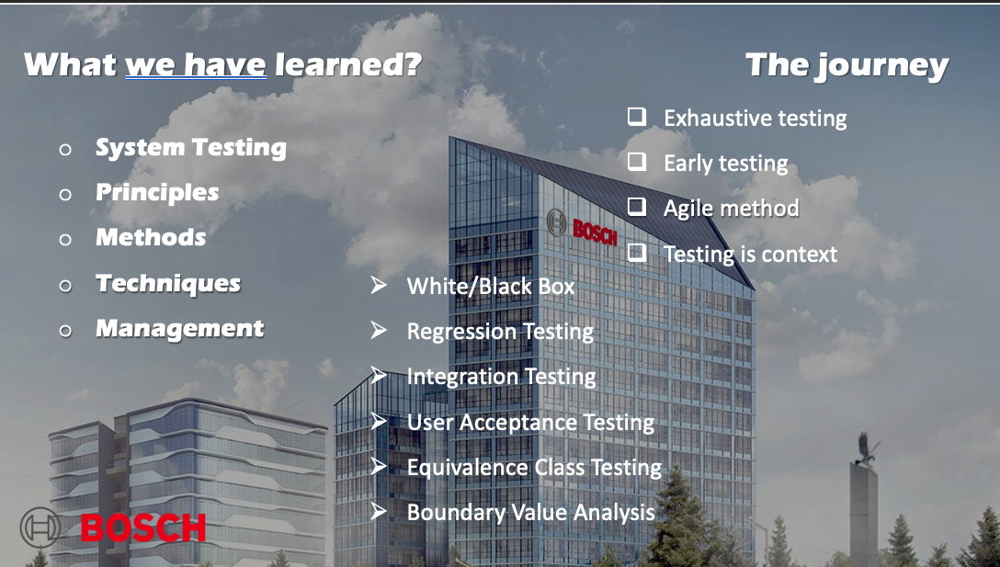

# ADAS TSR Test Example Project BOSCH




---

## CANoe Software and CAPL Language

### What is CANoe?

CANoe is a comprehensive software tool for the development, testing, and analysis of entire systems and individual ECUs that use the Controller Area Network (CAN) protocol. It is widely used in the automotive industry.

### What is CAPL?

CAPL (Communication Access Programming Language) is a C-based scripting language used in the CANoe environment. It allows users to simulate complex scenarios, create test cases, and automate tasks in the CANoe environment.

---


## Working with CANoe

### Nodes

Nodes represent the individual ECUs in a network. In CANoe, nodes are used to simulate ECUs or to represent real ECUs.

### Creating Panels for GUI Testing

1. Open the Panel Designer in CANoe.
2. Use drag-and-drop to add various controls like buttons, displays, and sliders to the panel.
3. Bind these controls to specific signals or messages in the CAN database.

### Manipulating Components with Code

Using CAPL, you can write scripts to interact with the GUI components, send and receive CAN messages, and even react to specific conditions or events on the bus.

### Reviewing the CAN HTML Report

CANoe provides an HTML-based report feature that gives a detailed overview of the test results, including passed and failed tests, detected errors, and more. This report can be generated after executing a test sequence.

---


## ADAS-TSR Feature Testing

### Introduction

The Traffic Sign Recognition (TSR) feature in the ADAS module is designed to detect traffic signs and report them over the CAN network to other ECUs for display or further calculations.

### Test Design Summary

The test is structured to ensure the TSR feature correctly reports overspeed warnings. The test steps include:

1. Setting ignition state and TSR feature activation.
2. Sending specific vehicle speed signals via CAN.
3. Asserting and verifying the TSR status and its warning messages based on given conditions.

#### Pseudo Code

```
// Test setup
Set Ignition OFF
Activate TSR feature

// Test execution
Send vehicle speed signals
Assert TSR status and warnings

// Expected Results
Verify TSR function reports as expected
```

For detailed test steps and expected results, refer to the [TSR Test Design document](TSR%20Test%20Design%20Filip%20Filchev%20Fixed.docx).

---

## Downloads

- [TSR Test Design Document](./TSR%20Test%20Design%20Filip%20Filchev%20Fixed.docx)

---
