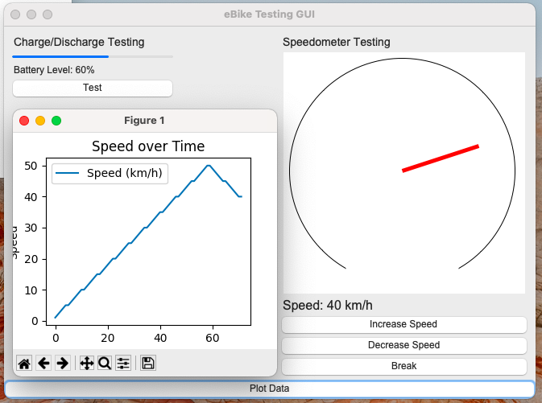

# Testing
CANoe, V-Studio, TSR, ADAS Systems

------------------------------------------------------------------------------------------------------------------------------------



# Testing Strategies in Python

This notebook covers best testing strategies in Python to ensure the reliability and robustness of the code.

## 1. Unit Testing

- Unit testing is a software testing technique where individual units or components of the software are tested. The purpose is to validate 
that each unit of the software code performs as expected.

```
import unittest

def add(x, y):
    return x + y

class TestAdditionFunction(unittest.TestCase):
    def test_add_positive_numbers(self):
        self.assertEqual(add(2, 3), 5)

    def test_add_negative_numbers(self):
        self.assertEqual(add(-1, -1), -2)

if __name__ == "__main__":
    unittest.main(argv=[''], verbosity=2, exit=False)
```

## 2. Integration Testing

Integration Testing is the phase in software testing in which individual software modules are combined and tested as a group. This mainly aims to test the interfaces and interaction between modules.

```
class Calculator:
    def add(self, x, y):
        return x + y
    
    def subtract(self, x, y):
        return x - y

class TestCalculator(unittest.TestCase):
    def test_add(self):
        calculator = Calculator()
        self.assertEqual(calculator.add(2, 3), 5)

    def test_subtract(self):
        calculator = Calculator()
        self.assertEqual(calculator.subtract(5, 3), 2)

if __name__ == "__main__":
    unittest.main(argv=[''], verbosity=2, exit=False)
```

## 3. Test-Driven Development (TDD)

Test-Driven Development (TDD) is a software development process where you write tests for your code before writing the actual code. The developer first writes a test case that describes the expected behavior, and then writes code to pass that test.


```

class TestTDDExample(unittest.TestCase):
    def test_multiply(self):
        calculator = Calculator()
        self.assertEqual(calculator.multiply(2, 3), 6)

```

# This will fail, as we haven't written the multiply method yet.


```
if __name__ == "__main__":
    unittest.main(argv=[''], verbosity=2, exit=False)

```

## 4. Property-based Testing

Property-based testing involves writing tests that generate random inputs each time they run. This helps in testing the function with a wide range of inputs.

```
from hypothesis import given
import hypothesis.strategies as st

@given(st.integers(), st.integers())
def test_add(x, y):
    assert add(x, y) == x + y
    
test_add()
```

## 5. Mocking

Mocking is used in testing when you want to isolate the code you are testing and do not want to call external services or codes.

```
from unittest.mock import Mock

mock_add = Mock(return_value=10)
mock_add(3, 3)  # This will return 10, regardless of input, because we have mocked the add function.

assert mock_add(3, 3) == 10
```
## Conclusion

Testing is a crucial aspect of software development. It ensures that your code is working as expected and helps you to catch and fix bugs early in the development process. There are different testing strategies and it is good to use a combination of them for a well-tested codebase.
