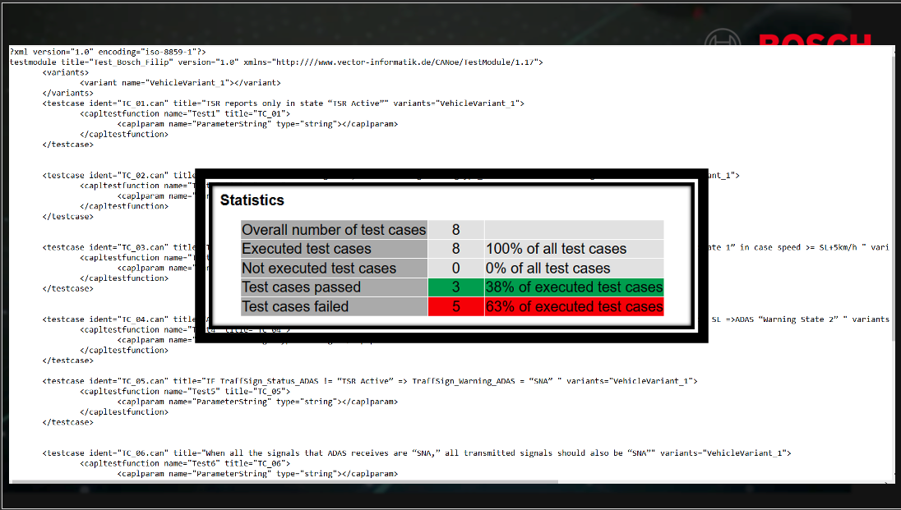
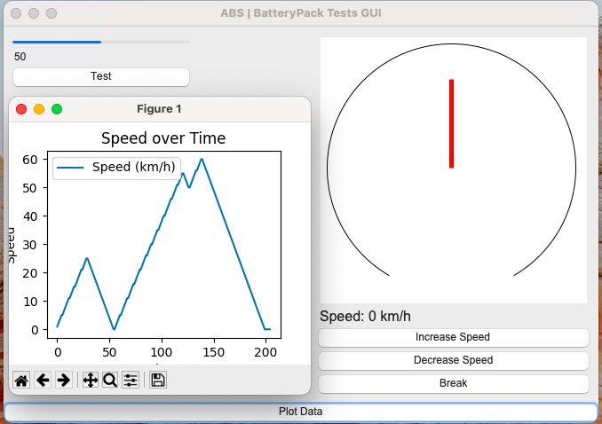

# Testing
CANoe, V-Studio, TSR, ADAS Systems

------------------------------------------------------------------------------------------------------------------------------------

# CANoe
**more CAN projects here -> CAN-ADAS-TSR**




# Testing Strategies in Python



This notebook covers best testing strategies in Python to ensure the reliability and robustness of the code.
#### Your code can't fail unit tests if you don't write any unit tests ;) 

## 1. Unit Testing

- Unit testing is a software testing technique where individual units or components of the software are tested. The purpose is to validate 
that each unit of the software code performs as expected.

- The unittest module is a built-in Python library for writing and running tests. It provides a set of tools for constructing and running test cases and suites. It follows the xUnit style of testing and is widely used for unit testing in Python.

```
import unittest

def add(x, y):
    return x + y

class TestAdditionFunction(unittest.TestCase):
    def test_add_positive_numbers(self):
        self.assertEqual(add(2, 3), 5)

    def test_add_negative_numbers(self):
        self.assertEqual(add(-1, -1), -2)

if __name__ == "__main__":
    unittest.main(argv=[''], verbosity=2, exit=False)
```

# Assert:

```
def multiply(a, b):
    result = a * b
    assert result > 0, "Multiplication result should be positive"
    return result

# Test case using assert
def test_multiply():
    assert multiply(2, 3) == 6
    assert multiply(-4, 5) == -20
    assert multiply(0, 8) == 0
    assert multiply(-2, -2) == 4

```


## 2. Integration Testing

Integration Testing is the phase in software testing in which individual software modules are combined and tested as a group. This mainly aims to test the interfaces and interaction between modules.

```
class Calculator:
    def add(self, x, y):
        return x + y
    
    def subtract(self, x, y):
        return x - y

class TestCalculator(unittest.TestCase):
    def test_add(self):
        calculator = Calculator()
        self.assertEqual(calculator.add(2, 3), 5)

    def test_subtract(self):
        calculator = Calculator()
        self.assertEqual(calculator.subtract(5, 3), 2)

if __name__ == "__main__":
    unittest.main(argv=[''], verbosity=2, exit=False)
```

# raise ValueError:

```
def divide(a, b):
    if b == 0:
        raise ValueError("Cannot divide by zero")
    return a / b

# Test case using try-except
def test_divide():
    assert divide(10, 2) == 5
    assert divide(7, 0) == ValueError("Cannot divide by zero")


```

The raise ValueError statement is used to explicitly raise a ValueError exception when attempting to divide by zero. This allows you to handle such cases explicitly in your code.


## 3. Test-Driven Development (TDD)

Test-Driven Development (TDD) is a software development process where you write tests for your code before writing the actual code. The developer first writes a test case that describes the expected behavior, and then writes code to pass that test.


```

class TestTDDExample(unittest.TestCase):
    def test_multiply(self):
        calculator = Calculator()
        self.assertEqual(calculator.multiply(2, 3), 6)

```

# This will fail, as we haven't written the multiply method yet.


```
if __name__ == "__main__":
    unittest.main(argv=[''], verbosity=2, exit=False)

```

# Try & Except:

```
def read_file(filename):
    try:
        with open(filename, "r") as file:
            content = file.read()
        return content
    except FileNotFoundError:
        return None

# Test case using pytest
def test_read_file():
    assert read_file("existing_file.txt") == "File content"
    assert read_file("nonexistent_file.txt") is None

```

In this example, the try; except block is used to catch a FileNotFoundError exception when attempting to read a file. If the file is not found, None is returned instead of raising an exception.


## 4. Property-based Testing

Property-based testing involves writing tests that generate random inputs each time they run. This helps in testing the function with a wide range of inputs.

```
from hypothesis import given
import hypothesis.strategies as st

@given(st.integers(), st.integers())
def test_add(x, y):
    assert add(x, y) == x + y
    
test_add()
```

## 5. Mocking

Mocking is used in testing when you want to isolate the code you are testing and do not want to call external services or codes.

```
from unittest.mock import Mock

mock_add = Mock(return_value=10)
mock_add(3, 3)  # This will return 10, regardless of input, because we have mocked the add function.

assert mock_add(3, 3) == 10
```

## 6. Pytest is a popular testing framework for Python that provides a simple and powerful way to write and run tests. It offers a wide range of features, including test discovery, test parameterization, fixtures for managing test resources, and powerful assertion statements for validating expected behavior.

- Some key features of pytest include:

Test discovery: pytest automatically discovers test files and functions based on naming conventions or directory structures, making it easy to organize and run tests.
Powerful assertions: pytest provides a rich set of assertion statements (assert) for comparing values, checking conditions, and validating expected behavior.
Test parametrization: pytest allows you to define test cases with different inputs using decorators like @pytest.mark.parametrize, reducing code duplication and improving test coverage.
Fixtures: pytest supports fixtures, which are functions or objects that provide test resources or set up test environments. Fixtures help in managing test dependencies and providing reusable test data.
Test configuration: pytest allows customizing the test configuration using configuration files or command-line options. It supports features like specifying test directories, controlling test verbosity, and enabling/disabling certain behaviors.
```
def is_even(number):
    return number % 2 == 0

# Failing test case using pytest
def test_is_even():
    assert is_even(3) is True
```

In this example, we have a function is_even that checks whether a given number is even or not. The test case asserts that is_even(3) should return False.

To run this test using pytest:

- Save the code in a Python file, e.g., test_is_even.py.
- Install pytest if you haven't already by running pip install pytest in your terminal.
- Open a terminal in the directory where your Python file is located.
- Run the command pytest in the terminal.
- pytest will automatically discover and run the test cases in your file.
- You should see the test result indicating that the test has failed.

  ### Output

```
============================= test session starts ==============================
...
collected 1 item

test_is_even.py F                                                          [100%]

=================================== FAILURES ===================================
_______________________________ test_is_even _________________________________

    def test_is_even():
>       assert is_even(3) is True
E       assert False is True
E        +  where False = is_even(3)

test_is_even.py:6: AssertionError
========================= 1 failed in 0.03 seconds ==============================
```
  

## Conclusion

Testing is a crucial aspect of software development. It ensures that your code is working as expected and helps you to catch and fix bugs early in the development process. There are different testing strategies and it is good to use a combination of them for a well-tested codebase.
